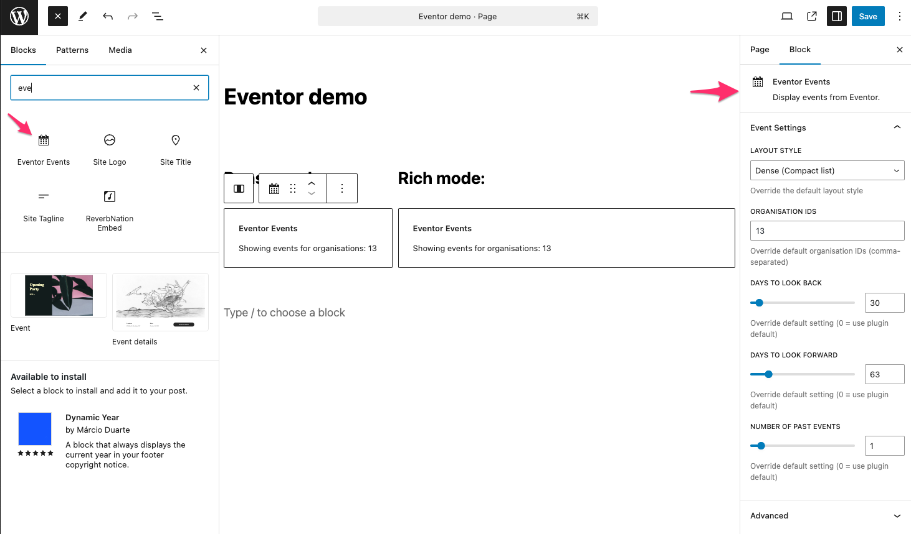
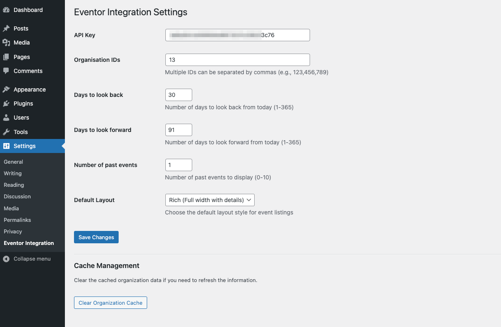
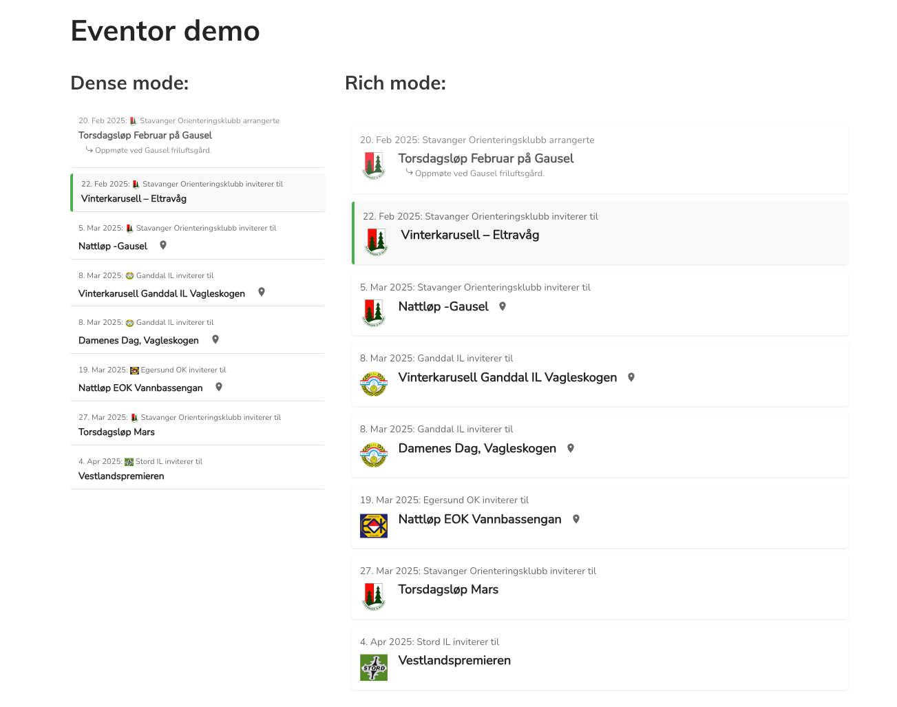

# Eventor Integration

This plugin integrates Eventor.no with WordPress and displays events in a custom Gutenberg block or using a shortcode.

## Features

- [ ] Events list block, where defaut settings can be overridden
- [ ] Select one or more organisations to display events from
- [ ] Select date ranges to display events from
- [ ] Optionally show past events
- [ ] Dense or rich layout

## Shortcode

The shortcode is used to display the events list in a page or post: `[eventor-events]`

## Gutenberg block

The Gutenberg block is used to display the events list block in the editor. Multiple instances of the block can be added to a page.

## Eventor API

The Eventor API is used to fetch the events from eventor.orientering.no. You'll need to get an API key from Eventor.no to use this plugin. You'll find this on eventor.orientering.no under the "Administration" tab if you have sufficient rights.

## Screenshots

### Events list block

### Settings

### Rich or dense layout

## Installation

1. Download the plugin zip file from [https://github.com/jonarnes/wp-eventor/releases/latest](https://github.com/jonarnes/wp-eventor/releases/latest)
2. Upload the plugin files to `/wp-content/plugins/wp-eventor` (or use the "Upload Plugin" function in the WordPress admin)
3. Activate the plugin through the 'Plugins' screen in WordPress
4. Go to Settings > Eventor Integration to configure your API key and settings

## Frequently Asked Questions

### Where do I get an API key?

The API key is available in Eventor if you have the sufficient permissions. If not, contact someone in your organization who has the permissions.

### How do I find my organization ID?

Your organization ID can be found in Eventor when logged in as an administrator. You can also figure out the ID by looking at the URL when viewing the organization in Eventor. The ID is the numbers at the end of the URL.

### Can I display events from multiple organizations?

Yes, you can enter multiple organization IDs separated by commas in the settings.

